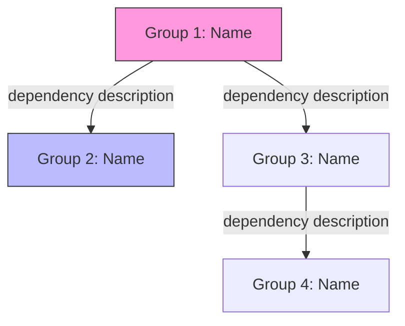

Analyze a codebase directory and partition its files into functional groups suitable for delegating to a team of agents, where each group fits within a single context window.

## Target

$ARGUMENTS

## Process

### Step 1: Inventory

Use the Explore agent to build a comprehensive file inventory of the target directory:

1. Recursively list ALL source files (skip node_modules, dist, out, .next, coverage, test-results, target, __pycache__, .git)
2. Note approximate line counts for each file
3. Map the directory structure and identify how files relate to each other

### Step 2: Identify Functional Boundaries

Analyze the inventory and identify natural groupings based on:

- **Cohesion**: Files that import each other heavily or share domain concepts belong together
- **Responsibility**: Each group should map to a single area of concern (auth, messaging, data layer, UI shell, etc.)
- **Completeness**: Include the types, tests, styles, and stores that belong to each functional area — an agent analyzing a group should have full context
- **Independence**: Minimize cross-group dependencies so agents can work in parallel

### Step 3: Size Constraints

Each group should target:

- **40-60 files maximum** (to fit in a single context window)
- **2,000-6,000 lines** (sweet spot for comprehensive analysis without truncation)
- Never split a tightly coupled pair (component + its test, store + its hook) across groups

### Step 4: Output Format

Present the partition as a structured table for each group:

```
## Group N: {Descriptive Name} (~{line_count} lines)

{One sentence describing the group's responsibility}

| Path | Lines | Why |
|------|-------|-----|
| relative/path/to/file.ext | NNN | Brief role description |
| ... | ... | ... |

**Analysis focus**: {2-3 specific concerns an agent should investigate for this group}
```

### Step 5: Summary Table

End with an overview table:

| # | Group | ~Lines | Key Concern |
|---|-------|--------|-------------|
| 1 | Name | N,NNN | Primary analysis focus |
| ... | ... | ... | ... |

## Guidelines

- Prefer grouping by **domain** (auth, chat, voice) over grouping by **file type** (all hooks, all stores)
- Co-locate a feature's components, hooks, stores, types, and tests in the same group
- Infrastructure files (build config, CI, entry points) can form their own group
- If a file is genuinely shared across many groups (e.g., a utility), place it in the group that uses it most, or in an infrastructure/shared group
- Name groups descriptively — an agent should understand its scope from the name alone
- Flag the groups that are most security-sensitive or architecturally foundational

### Step 6: Write Report File

After completing the analysis, write the full partition report to a markdown file at `docs/functional-partition/{target-basename}.md` (where `{target-basename}` is the last path component of the target directory, e.g. `desktop` for `clients/desktop/`).

The file MUST contain:

1. **Header**: `# Functional Partition: {target path}` with a timestamp
2. **All group tables** from Step 4 (the full analysis output)
3. **Summary table** from Step 5
4. **Mermaid architecture diagram** showing how the partitions relate:

```markdown
## Architecture


```

The mermaid diagram should:
- Show each partition group as a node
- Draw edges for cross-group dependencies (imports, shared types, API calls)
- Label edges with the nature of the dependency (e.g., "uses auth hooks", "renders components")
- Highlight security-sensitive or foundational groups with a distinct fill color
- Use `graph TD` (top-down) layout for readability

Confirm the file was written and print its path so the user can open it.
