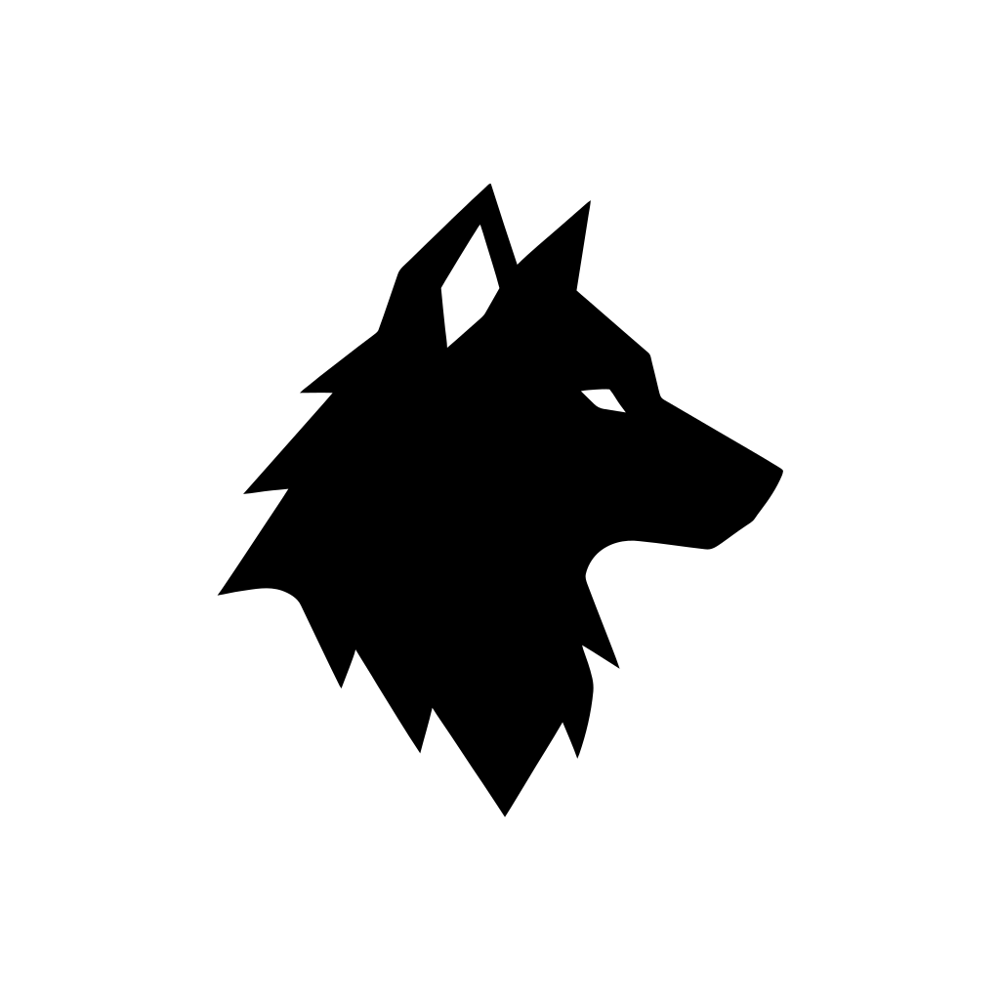

<p align="center">
  
</p>

<h1 align="center">Ryve</h1>

<p align="center">
  <strong>A native desktop IDE for multi-hand development.</strong>
</p>

<p align="center">
  Ryve coordinates terminals, coding tools, and structured work so parallel development can move fast without pinching, blocking, or kicking back.
</p>

<p align="center">
  
  
  
</p>

---

## What is Ryve?

**Ryve** is a desktop IDE for managing development work through autonomous coding processes, embedded terminals, and a structured workgraph.

It is named after the **riving knife** on a table saw: the safety device that keeps the cut open and prevents dangerous kickback. In the same way, Ryve keeps parallel development work moving safely by reducing collisions, ambiguity, and coordination failure.

Ryve is built for people who want:

- a native desktop environment
- multiple coding tools running side by side
- a terminal-first workflow
- structured work tracking inside the editor
- better coordination between active workers and the code they touch

---

## Core concepts

| Concept | Meaning |
|---|---|
| **Workshop** | A project workspace opened in Ryve |
| **Bench** | The tabbed work surface for terminals and tool sessions |
| **Hand** | An active worker process operating inside a workshop |
| **Crew** | An optional grouping of multiple Hands |
| **Spark** | A unit of work in the workgraph |
| **Bond** | A dependency or relationship between Sparks |
| **Ember** | A short-lived signal emitted during work |
| **Engraving** | Persistent workshop knowledge |
| **Alloy** | A coordination pattern for grouped work |

---

## Interface

Ryve combines a file explorer, a tabbed terminal bench, and an embedded workgraph.

```text
┌──────────────────────────────────────────────────────────────────┐
│ Workshop Tabs                                   [+ New Workshop] │
├──────────────────────────────────────────────────────────────────┤
│ File Explorer     │ Bench (tabbed terminals)   │ Workgraph       │
│                   │                             │                 │
│ > src/            │ [Terminal] [Claude] [+]    │ SP-001  P0      │
│   main.rs         │                             │ SP-002  P1      │
│   workshop.rs     │ $ claude --chat            │ SP-003  P2      │
│ > data/           │ > working on feature...    │                 │
│                   │                             │                 │
│ Active Hands      │                             │                 │
│ Claude Code       │                             │                 │
│ Aider             │                             │                 │
└──────────────────────────────────────────────────────────────────┘

Panels

Area	Purpose
File Explorer	Project tree with git-aware status display
Bench	Tabbed terminal and tool sessions
Active Hands	Running worker sessions inside the workshop
Workgraph	Sparks, Bonds, and coordination state


⸻

Features

Native desktop UI

Ryve is built with Iced for a fast, cross-platform Rust desktop experience.

Embedded terminals

Each workshop can run multiple terminal-backed sessions using alacritty-terminal through a patched iced_term integration.

Multi-tool workflow

Ryve detects supported coding tools on your PATH and can launch them directly into Bench tabs.

Supported tools currently include:
	•	Claude Code
	•	Codex
	•	Aider
	•	Goose
	•	Continue
	•	Cline

Workgraph-driven coordination

Ryve embeds structured work tracking directly into the editor through:
	•	Sparks for work items
	•	Bonds for dependencies
	•	Embers for short-lived signals
	•	Engravings for persistent knowledge
	•	Alloys for coordination patterns

Workshop-local state

Each workshop gets its own .ryve/ directory for config, data, and local context.

⸻

Architecture

Ryve is a Rust workspace made up of focused crates:

Crate	Purpose
src/	Main desktop application
data/	SQLite persistence, config, git, workgraph, integrations
llm/	Multi-provider LLM integration
ipc/	Single-instance and local coordination support
vendor/iced_term/	Vendored terminal widget integration

Built with
	•	Iced — native Rust GUI
	•	alacritty-terminal — terminal backend
	•	sqlx — SQLite access and migrations
	•	genai — multi-provider LLM support
	•	tokio — async runtime

⸻

Project layout

ryve/
├── Cargo.toml
├── src/                  # desktop app
├── data/                 # persistence, git, sparks, config
├── llm/                  # LLM client + protocol types
├── ipc/                  # local process coordination
├── vendor/
│   └── iced_term/        # patched embedded terminal widget
├── assets/
│   └── logo.svg
└── docs/


⸻

Requirements
	•	Rust stable
	•	A desktop OS supported by Iced
	•	Optional: one or more coding tools installed on your PATH

Recommended:
	•	latest stable Rust toolchain
	•	Git installed and available in shell
	•	one or more supported coding CLIs for Hand sessions

⸻

Getting started

git clone https://github.com/loomantix/ryve.git
cd ryve
cargo run

Build

cargo build

Run checks

cargo check
cargo test
cargo clippy --all-targets --all-features


⸻

Status

Ryve is in active development.

The project is currently focused on:
	•	core desktop UX
	•	terminal and tool session management
	•	workshop structure
	•	workgraph foundations
	•	multi-Hand coordination model

Expect rapid iteration.

⸻

Design goals

Ryve is being built around a few simple principles:
	•	native first — not a web app wrapped in a shell
	•	terminal centered — terminals are first-class, not bolted on
	•	structured coordination — work should be visible and traceable
	•	tool agnostic — Hands can be powered by different engines
	•	local ownership — workshop state lives with the project

⸻

Contributing

Ryve is open source and still early. The best way to contribute right now is to:
	•	open issues
	•	suggest UX improvements
	•	test workflows on real projects
	•	contribute focused PRs once the architecture stabilizes

A fuller contributor guide can be added as the project matures.

⸻

License

Licensed under AGPL-3.0-or-later. See LICENSE.

Copyright © 2026 Xerxes Noble